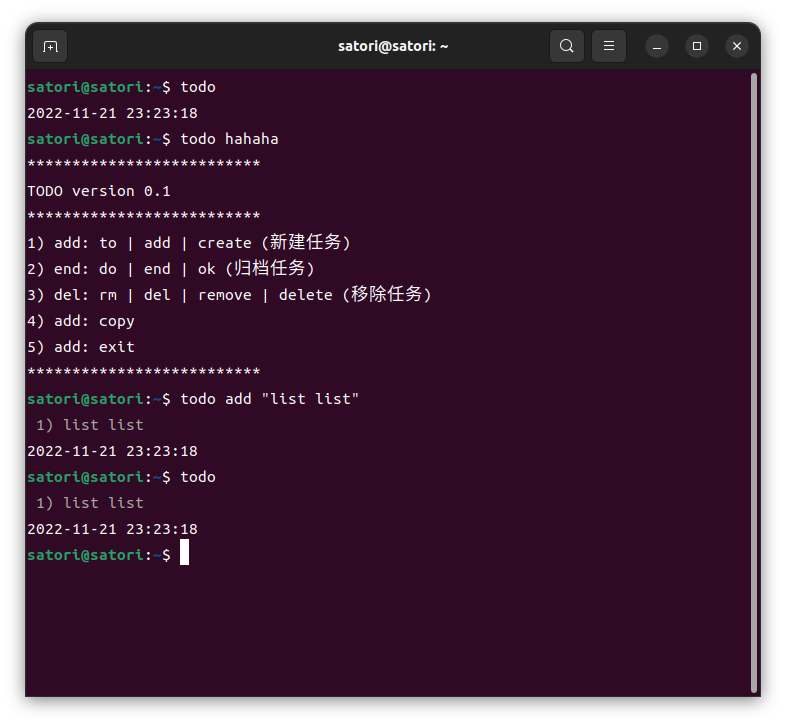

# todo
bash todo !!
使用命令快速创建 todo




```bash
# 使用 git 将项目克隆到本地
git clone git@github.com:InvisibleFuture/todo.git

# 进入项目文件夹, 设置文件执行权限 777
cd todo
chmod 777 main.sh

# 可以将文件复制到命令目录, 以便直接使命令 todo
sudo cp ./main.sh /usr/bin/todo

# 或是创建软链接以便于修改功能
sudo ln ./main.sh /usr/bin/todo

# 或是在没有 root 账户权限用于写入目录时, 也可以修改自己账户的 .bashrc 文件(注意当前文件路径)
echo 'alias todo="sh ~/todo/todo.sh"' >> ~/.bashrc
source ~/.bashrc

# 此时已经可用 todo 命令, 默认会显示帮助提示
todo
```

```bash
# 列出所有任务(每天首次打开附带提示help)
todo

# 查看帮助信息
todo help

# 新增一条
todo add "这是内容"

# 删除一条(其中1是列表中的序号)
todo delete 1
```
